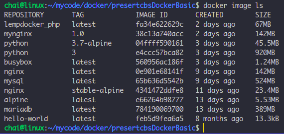
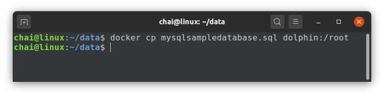
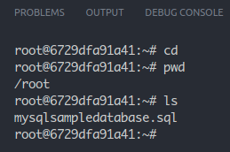
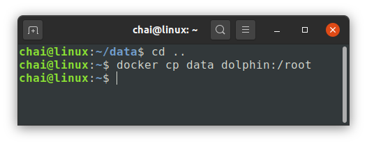
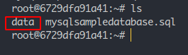

# basic commands
```
$ docker
$ docker --version
$ docker pull
$ docker images
$ docker images ls
$ docker ps
$ docker ps -a
$ docker container ls 
$ docker container ls -a
$ docker run
$ docker run -it busybox
$ docker exec -it alpine bash
$ docker container run
$ docker container stop
$ docker container start
$ docker container rm
$ docker image rm
```


```
$ docker run --rm --name dolphin -p 3306:3306 -e MYSQL_ROOT_PASSWORD=banana -d mysql
$ docker exec -it dolphin bash
$ docker exec -it 3fabd99f04dc bash

root@3fabd99f04dc:/# cat /etc/os-release 
root@3fabd99f04dc:/# which mysql
root@3fabd99f04dc:/# mysql -u root -p
mysql> show databases;
mysql> create database demo;
mysql> use demo;
mysql> create table menu(id int, descr varchar(50), price int);
mysql> insert into values (1, 'coffee', 30);
mysql> select * from menu;
mysql> insert into menu values (2, 'tea', 25);
mysql> exit
root@3fabd99f04dc:/# exit

$ docker container ls -a
$ docker container stop dolphin
```

```
$ docker image rm alpine
$ docker image rm busybox:musl
```
---
## 1. copy files ระหว่าง Host และ Docker containner
* ### check image
    ```
    $ docker image ls
    ```
    
* ### Run Program : mysql
    ```
    $ docker run --rm --name dolphin -d -p 3306:3306/tcp -p 33060:33060/tcp -e MYSQL_ROOT_PASSWORD=banana mysql:latest
    ```
    ```
    $ docker container ls
    ```
    ```
    $ docker exec -it dolphin bash
    ```
    ```
    root@eb49a692ad86:/# exit
    ```
* ### open new terminal
    ```
    $ docker cp mysqlsampledatabase.sql dolphin:/root
    ```
    
    ```
    root@6729dfa91a41:~# pwd
    root@6729dfa91a41:~# ls
    ```
    

    ```
    $ docker cp data dolphin:/root
    ```
    

    ```
    root@6729dfa91a41:~# ls
    ```
    

    ```
    root@6729dfa91a41:~# cat mysqlsampledatabase.sql
    root@6729dfa91a41:~# mysql -u root -p

    Enter password:banana

    mysql>
    mysql> show databases;
    mysql> \. mysqlsampledatabase.sql
    mysql> show databases;
    mysql> use classicmodels;
    mysql> show tables;
    mysql> select * from customers limit 2;
    mysql> select * from customers limit 2 \G
    mysql> \q
    ```
    ```
    root@6729dfa91a41:~# mysqldump -u root -p classicmodels customers > customers.sql
    root@6729dfa91a41:~# ls
    root@6729dfa91a41:~# cat customers.sql
    ```
    


