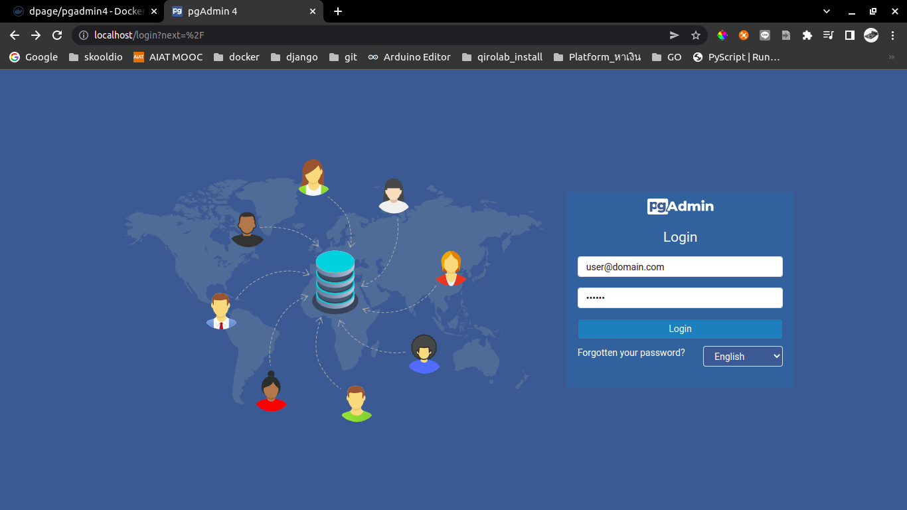
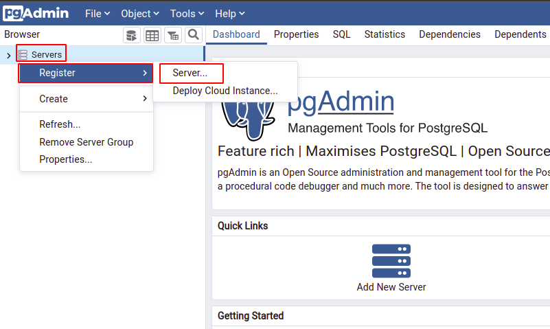
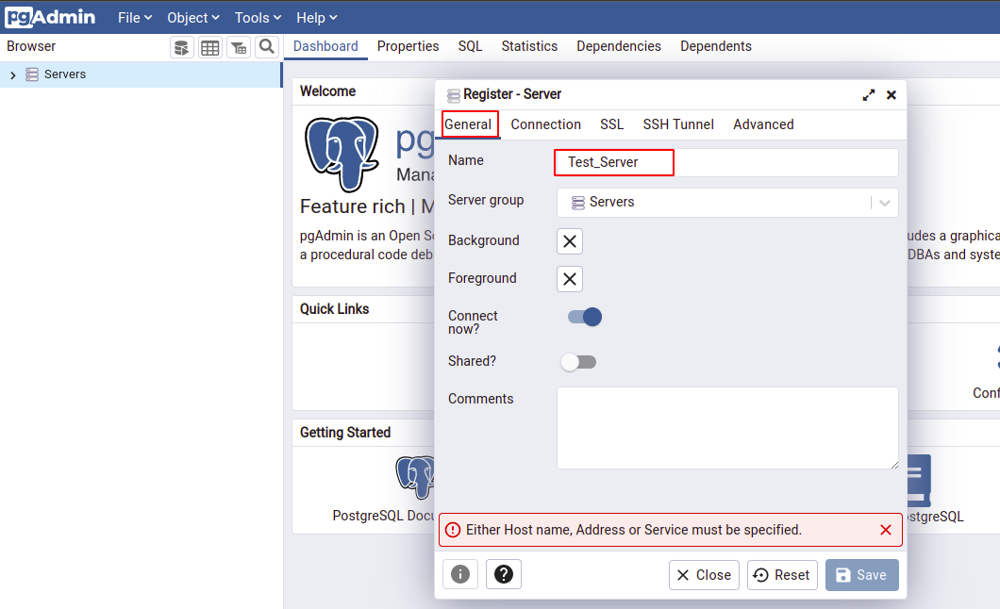
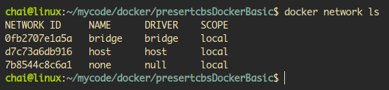
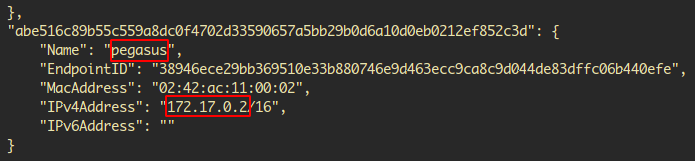
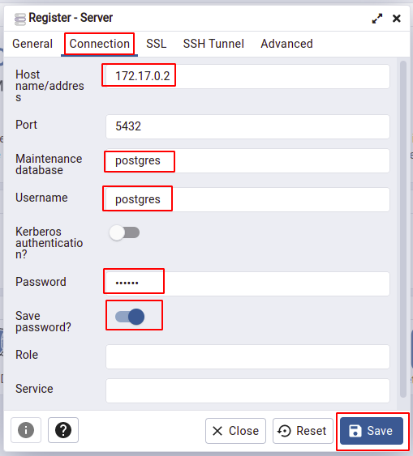
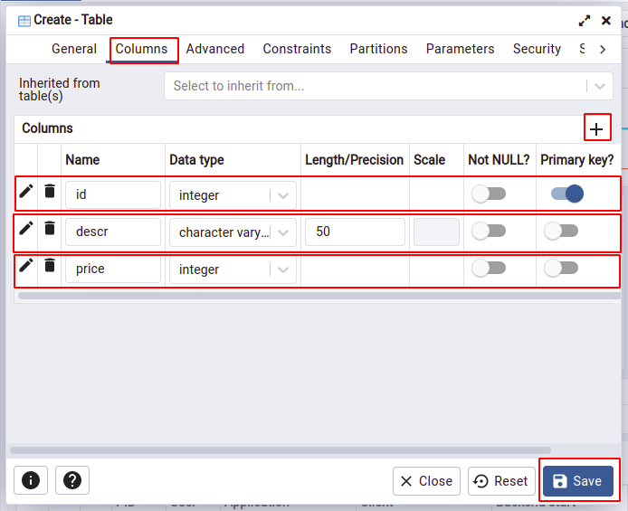
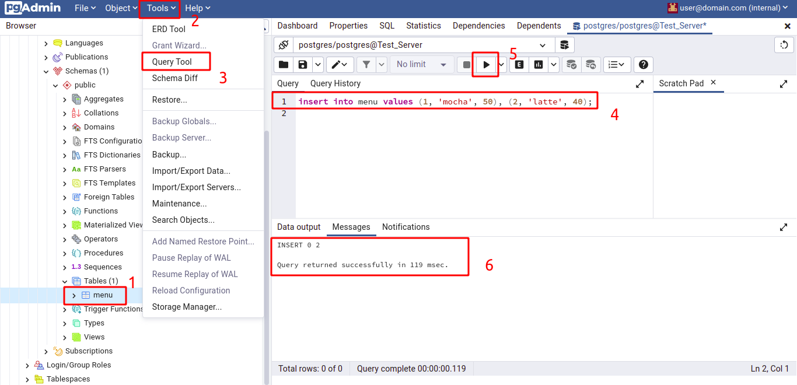

# `การใช้ docker เพื่อ run PostgreSQL และ pgadmin4`

## `1. pull image`
- [`postgres image`](https://hub.docker.com/search?q=postgres)
- [`pgadmin4`](https://hub.docker.com/r/dpage/pgadmin4)
    - [`websize_dpage/pgadmin4`](https://www.pgadmin.org/docs/pgadmin4/latest/container_deployment.html)
        ```
        $ docker pull dpage/pgadmin4
        ```
        ```
        
        ```
## `2. Run Image`
* `Run postgres`
    ```
    $ docker run --rm --name pegasus -e POSTGRES_PASSWORD=banana -d -p 5432:5432 -v pgvolume:/var/lib/postgresql/data postgres
    ```

* `Run pgadmin4`
    ```
    $ docker run -p 80:80 --name pg4 -e 'PGADMIN_DEFAULT_EMAIL=user@domain.com' -e 'PGADMIN_DEFAULT_PASSWORD=banana' -d dpage/pgadmin4
    ```
    ` Open Brower -> http://localhost:80 `

    

    

    


    `Add host Address`

    ` หา IP address ของ Postgres `

    ```
    $ docker network ls
    ```
    

    ```
    $ docker network inspect bridge 
    ```

    ```
    [
        {
            "Name": "bridge",
            "Id": "0fb2707e1a5afa3332ba7f0b56ea7d6a7ebf93c7e538b3dcdc8a7d239e2d80b5",
            "Created": "2022-06-19T09:03:16.606482274+07:00",
            "Scope": "local",
            "Driver": "bridge",
            "EnableIPv6": false,
            "IPAM": {
                "Driver": "default",
                "Options": null,
                "Config": [
                    {
                        "Subnet": "172.17.0.0/16",
                        "Gateway": "172.17.0.1"
                    }
                ]
            },
            "Internal": false,
            "Attachable": false,
            "Ingress": false,
            "ConfigFrom": {
                "Network": ""
            },
            "ConfigOnly": false,
            "Containers": {
                "3d48f20c31e66726dffd97529fabc5d27c16850092ce5b75b3cf7303434b751f": {
                    "Name": "pg4",
                    "EndpointID": "f50eb85cb1824f7a73bc3bcbfd94bd3fb6a4f98e588d3e1b3ae1dcc78ff257a1",
                    "MacAddress": "02:42:ac:11:00:03",
                    "IPv4Address": "172.17.0.3/16",
                    "IPv6Address": ""
                },
                "abe516c89b55c559a8dc0f4702d33590657a5bb29b0d6a10d0eb0212ef852c3d": {
                    "Name": "pegasus",
                    "EndpointID": "38946ece29bb369510e33b880746e9d463ecc9ca8c9d044de83dffc06b440efe",
                    "MacAddress": "02:42:ac:11:00:02",
                    "IPv4Address": "172.17.0.2/16",
                    "IPv6Address": ""
                }
            },
            "Options": {
                "com.docker.network.bridge.default_bridge": "true",
                "com.docker.network.bridge.enable_icc": "true",
                "com.docker.network.bridge.enable_ip_masquerade": "true",
                "com.docker.network.bridge.host_binding_ipv4": "0.0.0.0",
                "com.docker.network.bridge.name": "docker0",
                "com.docker.network.driver.mtu": "1500"
            },
            "Labels": {}
        }
    ]
    ```
    

    

---


`Server -> Test_Server -> Databases -> Schemas -> Tables`

`คลิกขวาที่ Tables -> Create -> Table`






[`Last Learnning VDO [11:25 / 20:32]`](https://www.youtube.com/watch?v=D79gYuUuEWo&list=PLoTScYm9O0GGJV7UpJs6NVvsf6qaKja9_&index=10)

```
$ git add .
$ git commit -m "v1.0"
$ git push
```

```
$ git add .
$ git commit -m "v1.0"
$ git tag v1.0
$ git push origin v1.0
$ git push -d origin v2.0
```

<!-- 11:25 / 20:32 -->


